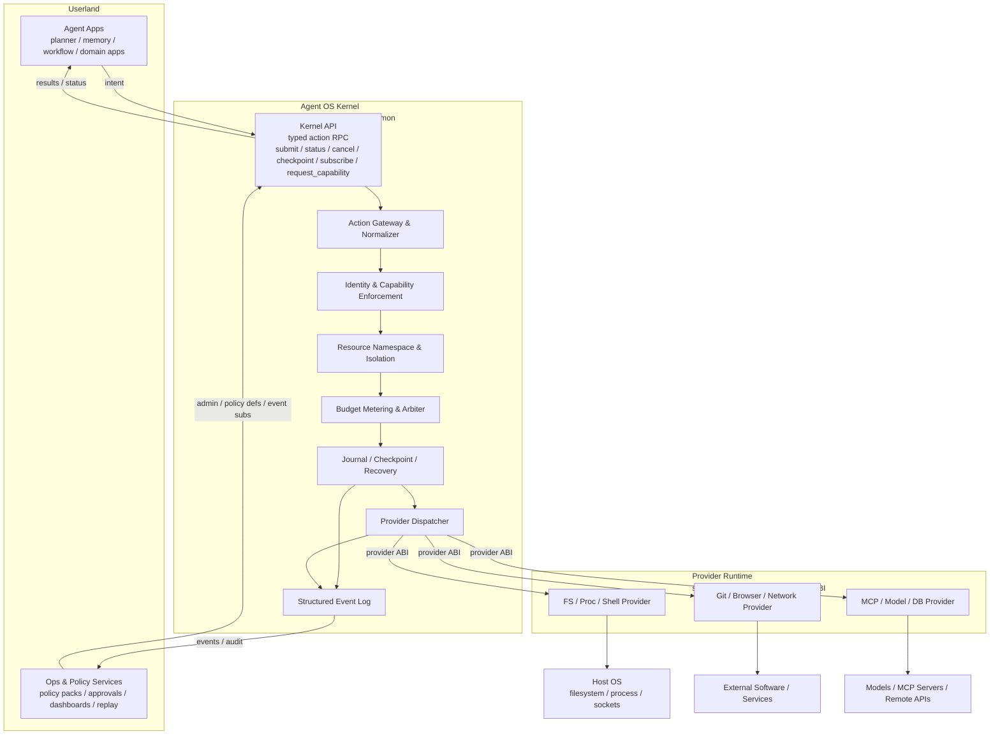
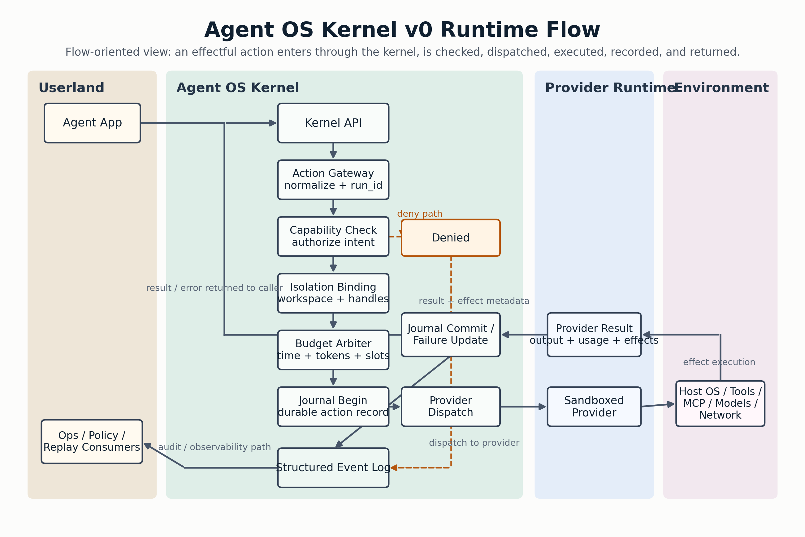

# Kernel Design v0

## Status

This document defines the **v0 design** of the **Agent OS Kernel**.

The design is derived strictly from two principles:

### Principle 1: Minimum

The kernel should include only the smallest set of mechanisms required to preserve system correctness, safety, and control.

It should not absorb higher-level application logic, workflow logic, or tool-specific customization.

### Principle 2: Extendable

The kernel should expose stable and composable extension interfaces, so that non-core capabilities can be implemented outside the kernel by developers or platform builders.

## 1. Definition

The **Agent OS Kernel** is a **minimal trusted control layer** that mediates all effectful interactions between AI agents and the external environment.

Its job is not to think, plan, or implement application logic. Its job is to ensure that every effectful action is:

- identified
- authorized
- isolated
- budgeted
- recorded
- recoverable

In this design, the kernel sits between:

- **Agent-side intent**
- **Provider-side execution**

and turns free-form requests into controlled, typed actions.

## 2. Design Thesis

The central idea of this kernel is:

> The kernel should control effects, not intelligence.

That means:

- planning belongs outside the kernel
- memory systems belong outside the kernel
- workflow logic belongs outside the kernel
- tool-specific logic belongs outside the kernel
- policy definitions may live outside the kernel
- policy enforcement must happen inside the kernel

The kernel is therefore closer to a **microkernel for agent execution** than to an all-in-one agent framework.

## 3. What Counts as an Effect

An action is considered **effectful** if it can change:

- external state
- shared runtime state
- system resources
- security posture
- cost consumption

Typical examples:

- reading or writing files
- spawning processes
- invoking shell commands
- calling MCP servers
- calling models
- making network requests
- mutating databases
- creating or delegating agent capabilities

Any such action must pass through the kernel.

## 4. Scope Boundaries

### 4.1 In Kernel

The v0 kernel includes only the following core mechanisms:

- **Action Gateway and Normalizer**
- **Identity and Capability Enforcement**
- **Resource Namespace and Isolation**
- **Budget Metering and Arbitration**
- **Journal, Checkpoint, and Recovery**
- **Provider Dispatcher**
- **Structured Event Log**

### 4.2 Explicitly Out of Kernel

The following are not part of the kernel:

- planners
- prompt orchestration
- memory and reflection systems
- workflow engines
- cron and job orchestration
- application-specific session logic
- tool-specific business logic
- domain-specific product behavior
- UI and dashboards
- approval UX
- policy authoring tools

These components are expected to run in userland and consume kernel services through stable interfaces.

## 5. High-Level Architecture

The architecture should be read in two complementary ways:

- a **structure view**, which shows responsibility boundaries
- a **runtime flow view**, which shows how a real action moves through the system

The v0 design should emphasize the runtime flow, because the kernel is defined by mediation of effects rather than by static module ownership alone.

### 5.1 Structure View



This view shows the trust boundary:

- userland produces intent
- the kernel mediates and records
- providers execute
- the host environment is reached only through providers

### 5.2 Runtime Flow View




This is the actual v0 execution path for an effectful action:

1. An agent emits intent.
2. The kernel turns that intent into a typed action.
3. The kernel checks capability, isolation, and budget before execution.
4. The kernel creates a durable record before handing off the effect.
5. A provider executes the effect in a sandboxed runtime.
6. The provider returns outputs, usage, and effect metadata.
7. The kernel commits the final record and emits events.
8. The agent receives the result, while operational systems observe the event stream.

### 5.3 Deny and Failure Paths

The runtime flow above also implies two important alternate paths:

- **deny path**: if capability, isolation, or budget checks fail, the action is rejected before provider execution, and the kernel emits a denial record
- **failure path**: if provider execution fails or is interrupted, the kernel records failure state, preserves recovery metadata, and emits failure events

This is important because the kernel is not only an execution router. It is the system component that defines when an action is:

- allowed
- denied
- started
- committed
- failed
- recoverable

That lifecycle perspective is the reason a flow-oriented architecture view is more accurate than a purely static box diagram.

## 6. Core Kernel Modules

### 6.1 Action Gateway and Normalizer

This is the mandatory ingress for all effectful actions.

Responsibilities:

- accept a typed action request
- validate the top-level schema
- normalize userland intent into canonical internal form
- attach context metadata
- assign a run identifier
- reject malformed or unsupported actions early

The gateway is intentionally dumb about application meaning. It understands only kernel-level action semantics.

### 6.2 Identity and Capability Enforcement

This module answers:

- who is making the request
- under which execution context
- with which capability set
- whether delegation is allowed

The capability model is the core authorization mechanism. Capabilities should be:

- explicit
- non-forgeable
- scoped
- delegable under constraints
- revocable

Examples:

- `fs.read:/workspace`
- `fs.write:/workspace/reports`
- `proc.exec:git`
- `mcp.call:server=scholar`
- `model.infer:model=gpt-5.4-mini`

Policy definitions may come from userland, but enforcement happens here.

### 6.3 Resource Namespace and Isolation

This module ensures that agents do not implicitly share mutable state.

Responsibilities:

- manage workspace namespaces
- issue resource handles
- isolate scratch state
- scope filesystem views
- scope process execution context
- prevent cross-agent interference by default

In v0, isolation can be implemented with practical user-space techniques such as:

- per-task working directories
- handle-based file access
- subprocess wrappers
- provider sandboxing

The design does not require a custom hardware kernel. It requires a trustworthy control boundary.

### 6.4 Budget Metering and Arbitration

This module enforces consumption boundaries.

It tracks and controls:

- wall-clock time
- CPU or execution slots
- token budgets
- API call counts
- provider call counts
- concurrency
- rate limits

This is a kernel mechanism, not a workflow scheduler.

It decides whether an action is allowed to consume more resources. It does not decide what the application should do next.

### 6.5 Journal, Checkpoint, and Recovery

This module provides execution durability and recoverability.

Responsibilities:

- append-only action records
- idempotency tracking
- checkpoint creation
- resume after interruption
- partial failure recording
- crash recovery metadata

In v0, the recovery model is intentionally conservative:

- the kernel guarantees durable records
- the kernel supports resumable contexts
- the kernel supports checkpoint boundaries
- the kernel does not promise full transactional rollback for arbitrary real-world side effects

This is important for keeping the design minimal and realistic.

### 6.6 Provider Dispatcher

This module maps a normalized action to the correct provider.

Responsibilities:

- discover compatible providers
- check provider version compatibility
- hand off execution through a stable ABI
- propagate cancellation
- collect outputs, usage, and effect metadata

The dispatcher must be generic. It must not contain tool-specific business logic.

### 6.7 Structured Event Log

Every action produces structured records and events.

Examples:

- `action_submitted`
- `action_denied`
- `action_started`
- `action_succeeded`
- `action_failed`
- `action_cancelled`
- `checkpoint_created`
- `capability_granted`

This log is the basis for:

- audit
- replay
- observability
- approval systems
- analytics
- external policy monitoring

## 7. Kernel Object Model

The v0 kernel treats the following as first-class objects:

### 7.1 Context

A `Context` is the minimal execution subject for a running task.

It binds together:

- identity
- inherited capabilities
- budgets
- namespace bindings
- checkpoint lineage

### 7.2 Action

An `Action` is a typed request for an effectful operation.

Examples:

- `fs.read`
- `fs.write`
- `proc.exec`
- `mcp.call`
- `model.infer`
- `net.http`

### 7.3 Capability

A `Capability` grants permission to perform a class of actions on a scoped resource.

### 7.4 Handle

A `Handle` is a kernel-issued reference to a resource. Providers should prefer handles over raw ambient access.

### 7.5 Budget

A `Budget` represents allowed resource consumption.

### 7.6 Record

A `Record` is the durable account of what happened, why it happened, and what it consumed.

## 8. Kernel API

### 8.1 API Style

The kernel API exposed to agents is a **small, stable, syscall-like typed action API**.

It is not:

- a shell wrapper API
- a prompt protocol
- a workflow DSL
- a tool-by-tool custom interface

### 8.2 Transport

Recommended v0 transport:

- local deployment: `Unix socket + gRPC` or `Unix socket + JSON-RPC`
- remote deployment: `gRPC` or authenticated HTTP

The transport is not the architecture. The typed action boundary is the architecture.

### 8.3 Core Methods

The v0 API surface should be minimal:

- `submit(action_request)`
- `status(run_id)`
- `cancel(run_id)`
- `checkpoint(context_id, label)`
- `resume(checkpoint_id)`
- `subscribe(event_filter)`
- `request_capability(request)`

### 8.4 Example Action Request

```json
{
  "context_id": "ctx_7",
  "action": "fs.write",
  "target": "workspace://report.md",
  "input": {
    "content": "Kernel design draft"
  },
  "constraints": {
    "timeout_ms": 5000,
    "idempotency_key": "task-42-step-3"
  }
}
```

### 8.5 Example Action Result

```json
{
  "run_id": "run_123",
  "status": "succeeded",
  "output": {
    "bytes_written": 19
  },
  "usage": {
    "wall_ms": 41
  },
  "effects": [
    {
      "type": "fs.modified",
      "target": "workspace://report.md"
    }
  ]
}
```

## 9. Provider Runtime

### 9.1 Provider Role

Providers implement non-core capabilities outside the kernel.

Examples:

- filesystem provider
- process and shell provider
- git provider
- browser provider
- model provider
- MCP provider
- database provider

Providers are conceptually similar to device drivers, but they run in user-space isolation boundaries.

### 9.2 Provider Runtime Form

In v0, providers should run as:

- separate processes
- containers
- or WASM sandboxes

The requirement is not a specific sandbox technology. The requirement is that providers are isolated and cannot bypass kernel control.

### 9.3 Provider ABI

The provider ABI should be versioned and stable.

Minimum interface:

- `manifest()`
- `validate(request)`
- `execute(request)`
- `cancel(run_id)`
- `health()`

Optional interface:

- `snapshot(handle)`
- `resume(snapshot_id)`
- `compensate(record)`

### 9.4 Example Provider Manifest

```json
{
  "name": "proc-shell",
  "version": "0.1.0",
  "actions": ["proc.exec"],
  "required_capabilities": ["proc.exec"],
  "supports_cancel": true,
  "supports_snapshot": false
}
```

### 9.5 Example Provider Request

```json
{
  "run_id": "run_123",
  "context_id": "ctx_7",
  "action": "proc.exec",
  "handles": ["h_workspace_1"],
  "capabilities": ["proc.exec:git", "fs.read:/workspace"],
  "budget": {
    "wall_ms": 5000
  },
  "input": {
    "argv": ["git", "status"],
    "cwd": "/workspace"
  }
}
```

### 9.6 Example Provider Result

```json
{
  "status": "ok",
  "output": {
    "stdout": "On branch main",
    "stderr": "",
    "exit_code": 0
  },
  "usage": {
    "wall_ms": 310
  },
  "effects": [
    {
      "type": "process.spawned"
    }
  ]
}
```

## 10. End-to-End Execution Flow

The v0 execution path is:

1. An agent app submits an action through the Kernel API.
2. The Action Gateway validates and normalizes the request.
3. Identity and Capability Enforcement checks authorization.
4. Resource Namespace and Isolation binds the request to its scope.
5. Budget Metering and Arbitration reserves or verifies budget.
6. Journal creates a durable action record.
7. Provider Dispatcher selects the correct provider.
8. The provider executes within its sandbox.
9. Outputs, usage, and effect metadata return to the kernel.
10. Journal updates the durable record and checkpoint lineage if needed.
11. Structured events are emitted.
12. The final result is returned to the caller.

## 11. Runtime Placement

The Agent OS Kernel runs as a **trusted user-space daemon or service**.

It runs:

- above the host operating system
- below agent applications
- above providers and their controlled access to the host environment

### 11.1 Local Mode

In local mode:

- one kernel daemon runs on the developer machine or workstation
- agents connect through local RPC
- providers access local tools and files through controlled interfaces

### 11.2 Remote Mode

In remote mode:

- one kernel service runs per tenant, workspace, or execution domain
- agents connect over authenticated RPC
- providers run as isolated worker pools

The key architectural rule is:

> The kernel must not be embedded inside a single agent implementation.

If it is embedded inside one agent, it becomes an internal framework module, not a kernel.

## 12. Security and Correctness Invariants

The v0 design is defined by three hard invariants:

### 12.1 No Effect Without Mediation

No effectful action may bypass the kernel.

### 12.2 No Action Without Identity, Capability, and Budget

Every action must be bound to:

- a context
- a capability set
- a budget envelope

### 12.3 No State Change Without Record

Every committed action must produce a durable structured record.

These invariants are more important than any individual transport or implementation detail.

## 13. Why This Satisfies Principle 1: Minimum

This design satisfies **Minimum** because the kernel includes only mechanisms that are necessary to preserve correctness, safety, and control.

### 13.1 Why Each Kernel Module Is Necessary

- `Action Gateway` is necessary because without a mandatory ingress there is no unified control point.
- `Capability Enforcement` is necessary because authorization cannot be left to convention.
- `Isolation` is necessary because shared mutable state breaks correctness and safety.
- `Budget Metering` is necessary because uncontrolled resource use breaks system control.
- `Journal and Recovery` are necessary because correctness requires durable records and resumable boundaries.
- `Provider Dispatcher` is necessary because effect execution must remain under kernel routing and observation.
- `Structured Event Log` is necessary because auditability is part of system control.

### 13.2 Why Higher-Level Logic Is Excluded

The design deliberately excludes:

- agent cognition
- planner semantics
- workflow semantics
- domain logic
- tool-specific product logic

Those concerns are real, but they are not required to preserve kernel-level correctness, safety, and control.

Therefore they do not belong in the kernel.

## 14. Why This Satisfies Principle 2: Extendable

This design satisfies **Extendable** because every non-core capability is moved behind stable interfaces rather than being hardcoded into kernel logic.

### 14.1 Stable Extension Surfaces

The v0 architecture exposes four extension surfaces:

- **Kernel API** for agent-side consumers
- **Provider ABI** for capability implementations
- **Event Stream** for observers, dashboards, approvals, and analytics
- **External Policy Inputs** for userland policy definition systems

### 14.2 Why This Is Truly Extendable

Developers or platform builders can add new capabilities by building providers such as:

- a new git provider
- a browser automation provider
- an enterprise MCP provider
- a database provider
- a model routing provider

without changing:

- the kernel object model
- the kernel trust boundary
- the kernel control flow

That is the core meaning of extensibility in this design.

## 15. v0 Non-Goals

The following are explicitly out of scope for v0:

- distributed multi-node scheduling
- full transactional rollback for arbitrary side effects
- application-level workflow languages
- advanced policy synthesis
- sophisticated memory or reasoning architectures
- hardware-level virtualization
- custom host operating system kernels

v0 is intentionally small. Its goal is to establish the correct trust boundary and extension model first.

## 16. Summary

The v0 Agent OS Kernel is a **minimal, user-space, trusted mediation layer**.

It is minimal because it contains only the mechanisms required for:

- correctness
- safety
- control

It is extendable because all non-core capabilities are implemented through stable interfaces outside the kernel.

In short:

> The kernel owns mediation, authorization, isolation, budgeting, recovery, and audit.
>
> Userland owns intelligence, workflow, product semantics, and customization.

This division is the architectural foundation of the v0 design.
