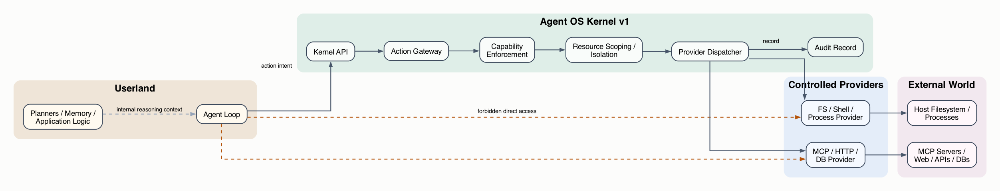
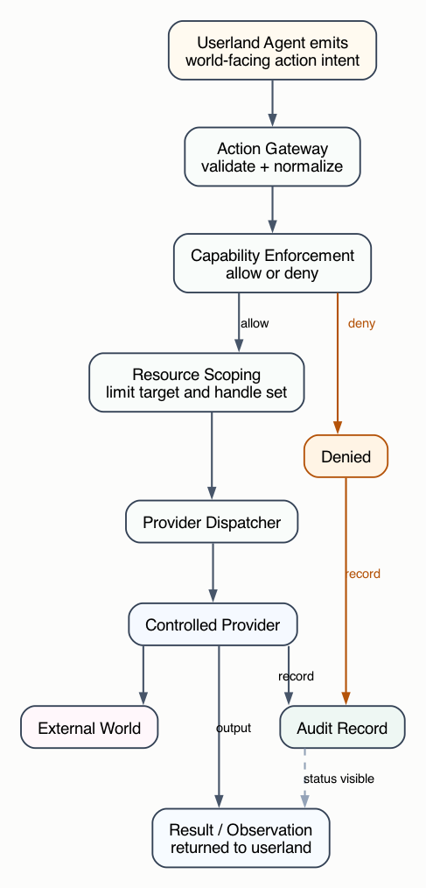

# Kernel Design v1

## Status

This document defines the **v1 design** of the **Agent OS Kernel**.

Unlike v0, this version is deliberately narrower.

The goal of v1 is **not** to define a full agent operating system.
The goal of v1 is only to define the **smallest kernel that is sufficient to enforce security control over agent actions**.

In other words:

> v1 is a **security boundary**, not a general agent platform.

## 1. Design Goal

The v1 kernel exists to guarantee one thing:

> **No agent may reach the outside world except through a mandatory kernel-controlled path.**

That is the entire purpose of this design.

If a mechanism does not directly contribute to that goal, it should not be in the v1 kernel.

## 2. What v1 Protects

The kernel must control all **world-facing actions**.

These include:

- file reads
- file writes
- process execution
- shell execution
- MCP calls
- HTTP and network access
- database access
- model calls, if model access is treated as a controlled external capability

In security terms, both **read** and **write** actions matter.

Reading is not harmless. A read can expose secrets.

Therefore, the kernel is not only an effect egress boundary.
It is the mandatory **world boundary**.

## 3. Minimal Security Thesis

If the only question is:

> “What is the smallest kernel we need in order to control agent security?”

then the answer is:

- one mandatory action ingress
- one authorization mechanism
- one resource scoping mechanism
- one provider dispatch path
- one immutable audit trail

Everything else is optional.

## 4. What v1 Removes from v0

The v0 design included several mechanisms that are useful in a richer system but are not strictly required for the minimal security boundary.

v1 removes or downgrades the importance of:

- budgeting as a first-class kernel feature
- checkpoint and recovery as a first-class kernel feature
- resumability as a first-class kernel feature
- dynamic capability request workflows
- policy authoring workflows
- event systems as a major architectural focus
- rich provider lifecycle features
- generalized extensibility as a primary goal

These may return in later versions, but they are not required to make the kernel the sole security boundary.

## 5. Definition

The **Agent OS Kernel v1** is a **minimal trusted mediation layer** that enforces authorization and isolation on all world-facing actions emitted by an agent runtime before those actions can reach any real external capability.

The kernel does not:

- reason
- plan
- rank options
- write prompts
- maintain user-facing workflows
- implement domain behavior

The kernel only:

- receives action intents
- checks whether they are allowed
- scopes what they may touch
- dispatches them to controlled providers
- records what happened

## 6. Scope Boundaries

### 6.1 In Kernel

The v1 kernel includes only five core components:

- **Action Gateway**
- **Capability Enforcement**
- **Resource Scoping and Isolation**
- **Provider Dispatcher**
- **Audit Record**

### 6.2 Out of Kernel

The following are explicitly out of scope for v1:

- planners
- memory systems
- workflow engines
- cron and orchestration
- prompt management
- application logic
- tool-specific product logic
- approval UX
- dashboards
- analytics
- generalized event pipelines
- policy authoring systems
- checkpoint orchestration
- recovery orchestration

## 7. High-Level Architecture

### 7.1 Structure View

The structure view focuses on the trust boundary.

The key idea is simple:

- userland may produce intents
- only the kernel may reach providers
- only providers may reach the external world

The visualization below is generated from [`kernel_design_v1_structure.dot`](./figures/kernel_design_v1_structure.dot).



This diagram is intentionally simple.

That is the point of v1.

The security boundary is:

```text
Userland -> Kernel -> Provider -> World
```

If anything can skip that path, the kernel has failed.

### 7.2 Security Flow View

The flow view shows the lifecycle of one world-facing action.

The action may either:

- be denied before execution
- be scoped, dispatched, executed, and recorded

The visualization below is generated from [`kernel_design_v1_flow.dot`](./figures/kernel_design_v1_flow.dot).



## 8. Core Components

## 8.1 Action Gateway

The Action Gateway is the single ingress for all world-facing actions.

Responsibilities:

- accept an action request
- validate top-level structure
- normalize action names and targets
- reject malformed requests

Without this component, there is no mandatory control point.

## 8.2 Capability Enforcement

This is the core authorization mechanism.

It answers:

- who is making the request
- which action is being requested
- which resource is being targeted
- whether this context is allowed to perform that action

Examples of capabilities:

- `fs.read:/workspace`
- `fs.write:/workspace/reports`
- `proc.exec:git`
- `mcp.call:server=scholar`
- `net.http:host=example.com:method=GET`

Capability issuance may come from outside the kernel.
Capability enforcement must happen inside the kernel.

## 8.3 Resource Scoping and Isolation

Authorization is not enough. A request also needs scope.

This component ensures that actions are limited to:

- allowed workspaces
- allowed paths
- allowed process contexts
- allowed downstream endpoints
- allowed provider-visible handles

The kernel should prefer explicit scoped targets such as:

- `workspace://repo`
- `mcp://scholar/search`
- `https://example.com`

instead of broad ambient access.

## 8.4 Provider Dispatcher

The dispatcher is the only path from kernel decisions to real-world execution.

Responsibilities:

- map action types to providers
- pass scoped requests to providers
- prevent userland from talking to providers directly

The dispatcher must remain generic.

It should not contain:

- workflow logic
- domain-specific rules
- tool-specific behavior beyond routing

## 8.5 Audit Record

v1 keeps one minimal but non-negotiable observability mechanism:

- every allowed or denied world-facing action produces a durable record

At minimum, a record should include:

- action identity
- caller context
- target
- provider
- final status

The purpose of the audit record is not analytics.
Its purpose is security accountability.

## 9. Minimal Kernel Object Model

v1 only needs four core objects:

### 9.1 Context

A context is the execution identity of the caller.

### 9.2 ActionRequest

An action request is a typed world-facing intent.

### 9.3 Capability

A capability expresses what this context may do.

### 9.4 Record

A record captures what was attempted and what happened.

Optional objects such as budgets, checkpoints, and snapshots are excluded from the minimal v1 core.

## 10. Minimal Kernel API

v1 should expose the smallest possible API surface.

Required methods:

- `submit(action_request)`
- `read_record(run_id)` or equivalent audit lookup

Optional methods:

- `status(run_id)`

That is enough for a security boundary.

The kernel API does not need to expose:

- planning interfaces
- workflow interfaces
- direct tool interfaces
- provider-specific interfaces

## 11. Minimal Provider Model

Providers are outside the kernel but below userland.

They are the only components that touch the external world.

v1 requires only a minimal provider contract:

- declare which action types a provider handles
- accept a scoped kernel request
- execute the real effect
- return a normalized result

A conceptual provider interface is:

```python
class Provider:
    actions: list[str]

    def execute(self, context, request):
        raise NotImplementedError
```

That is enough for v1.

Advanced provider lifecycle features are not required at this stage.

## 12. Runtime Placement

The v1 kernel runs as a **trusted user-space daemon or service**.

It sits:

- below userland agent runtimes
- above providers
- above no application logic

It must be the only component that has authority to call providers.

If userland can reach providers directly, the kernel is not real.

## 13. Hard Security Invariants

The v1 design is defined by these invariants:

### 13.1 No World Access Without Kernel Mediation

No world-facing action may bypass the kernel.

### 13.2 No Provider Access From Userland

Userland must not talk directly to shell, MCP, HTTP, filesystem, or other providers.

### 13.3 No Authorization Outside the Kernel

Policies may be authored elsewhere, but the allow/deny decision must be enforced in the kernel.

### 13.4 No Action Without Record

Every allowed or denied action must produce a record.

These four invariants are the real content of v1.

## 14. Why This Is Enough

If the only purpose of the kernel is to control security, then v1 is sufficient because it guarantees:

- one mandatory ingress
- one mandatory authorization point
- one mandatory scoping point
- one mandatory execution path
- one mandatory accountability path

This is enough to prevent the most important failure mode:

> the model or runtime reaching the outside world through an uncontrolled bypass path

That is the central security problem.

v1 addresses it directly and with minimal architectural surface.

## 15. Non-Goals

v1 is not trying to solve:

- agent quality
- planning quality
- memory quality
- orchestration quality
- retry strategies
- workflow expressiveness
- human approval systems
- advanced observability
- recovery semantics
- distributed scheduling

Those may matter later, but they do not define the minimal security kernel.

## 16. Summary

The v1 Agent OS Kernel is intentionally small.

It is not a platform for agent intelligence.
It is not a workflow engine.
It is not a tool framework.

It is only a **security boundary**.

Its minimal architecture is:

- `Action Gateway`
- `Capability Enforcement`
- `Resource Scoping / Isolation`
- `Provider Dispatcher`
- `Audit Record`

Everything else can wait.

If the system guarantees that all world-facing actions must pass through those five mechanisms, then v1 has done its job.
