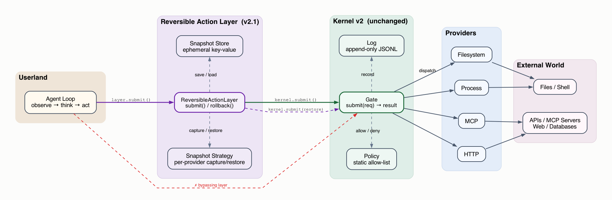
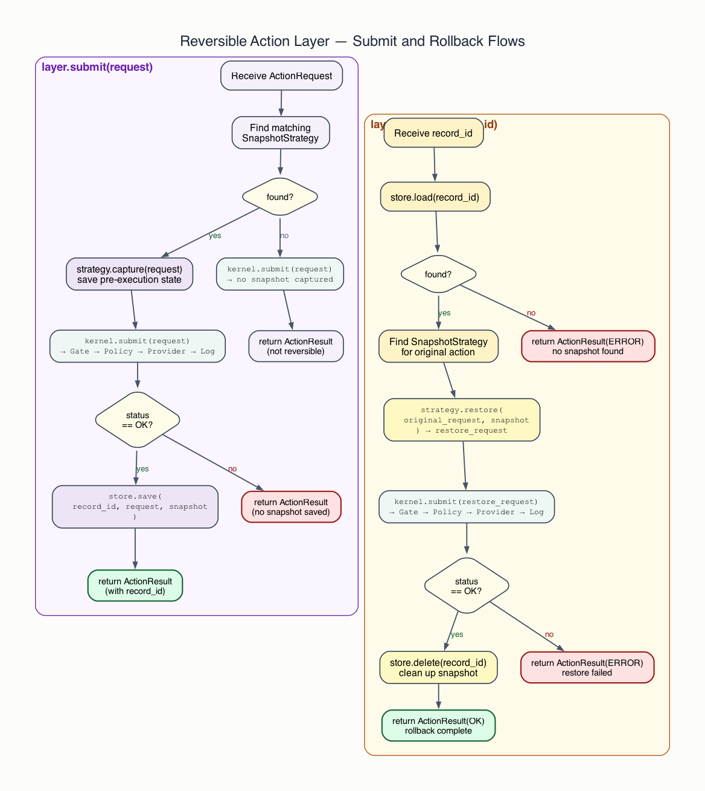
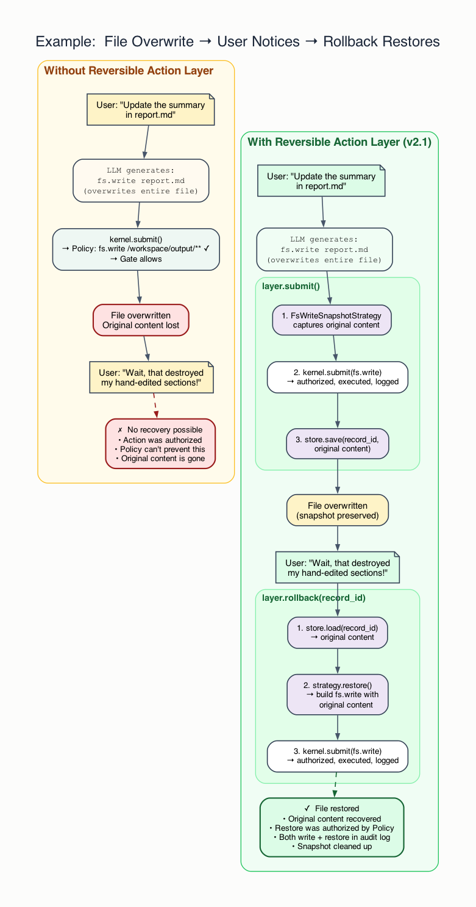

# Kernel Design v2.1 — Reversible Actions

## Status

This document extends **v2** with an optional **Reversible Action Layer** — a mechanism that allows certain world-facing actions to be rolled back after execution.

v2.1 does **not** modify the kernel. It is a layer built on top of the v2 kernel, using only the existing `submit()` API. The three v2 invariants (all access through Gate, default deny, no silent actions) remain unchanged.

v2.1 answers one question:

> How can we provide rollback for reversible actions without adding complexity to the kernel itself?

## 1. Motivation

The v2 kernel prevents unauthorized actions. But authorized actions can still cause harm — the LLM may misinterpret intent and perform a destructive but permitted operation. Policy bounds the **scope** of damage; rollback bounds the **duration**.

Example: the agent has `fs.write` permission on `/workspace/output/**`. It overwrites a report the user spent hours editing. The action was authorized, so the Gate allowed it. Without rollback, the file is gone. With rollback, the previous version can be restored.

Rollback is not a substitute for policy. It is a safety net for the gap between "permitted" and "intended."

### 1.1 Not All Actions Are Reversible

Reversibility is a property of the action type, not the kernel:

| Action Type | Reversible? | Why |
|---|---|---|
| `fs.read` | N/A | Side-effect-free; nothing to undo |
| `fs.write` | Yes | File content can be snapshotted and restored |
| `proc.exec` | Sometimes | Depends on the command; `git checkout` yes, `rm -rf /` no |
| `mcp.call` | Sometimes | Read-only calls no; mutations depend on the MCP server |
| `net.http` | Generally no | GET is safe; POST/PUT/DELETE may be irreversible externally |

Because reversibility varies by provider and by specific request, rollback **cannot be a universal kernel guarantee**. It must be opt-in, provider-specific, and best-effort.

## 2. Design Principle: Rollback as a Layer

v2 §11 states: *"Everything else — budgets, checkpoints, recovery, events — is out of scope. They can be layered on top."*

v2.1 follows this principle exactly. The Reversible Action Layer sits between the agent loop and the kernel, wrapping `kernel.submit()` without modifying it.

### 2.1 Why Not Inside the Kernel?

Three reasons:

1. **Preserves v2's core claim.** The kernel remains ~30 lines, one API, three components. Rollback is a separate concern.

2. **Rollback actions go through the Gate.** A rollback is itself a world-facing action (e.g., `fs.write` to restore a file). It must be authorized and logged, just like any other action. This falls out naturally when rollback lives outside the kernel.

3. **Avoids the "partial support" problem.** If rollback were a kernel API, users would expect it to work for all actions. As a separate layer, it is clearly opt-in and best-effort.

## 3. Architecture

### 3.1 Structure View

The Reversible Action Layer wraps the kernel without replacing it. The agent loop calls the layer; the layer calls the kernel. Rollback requests also go through the kernel.

The visualization below is generated from [`kernel_design_v2.1_structure.dot`](./figures/kernel_design_v2.1_structure.dot).



### 3.2 Rollback Flow

The flow diagram shows the lifecycle of a reversible `submit()` and a subsequent `rollback()` call. Both paths produce kernel log records via the normal Gate path.

The visualization below is generated from [`kernel_design_v2.1_rollback_flow.dot`](./figures/kernel_design_v2.1_rollback_flow.dot).



### 3.3 Walkthrough: File Overwrite and Rollback

The agent has `fs.write` permission on `/workspace/output/**`. It overwrites `report.md` with incorrect content. The user notices and requests a rollback. The layer restores the original file — through the kernel, so the restore is authorized and logged.

The visualization below is generated from [`kernel_design_v2.1_example_rollback.dot`](./figures/kernel_design_v2.1_example_rollback.dot).



## 4. Components

### 4.1 Snapshot Strategy

A **Snapshot Strategy** captures the state needed to reverse an action. Each provider that supports rollback defines its own strategy.

```python
class SnapshotStrategy:
    """Captures pre-execution state for a specific action type."""

    def supports(self, request: ActionRequest) -> bool:
        """Whether this strategy can snapshot the given request."""
        raise NotImplementedError

    def capture(self, request: ActionRequest) -> Any:
        """Capture state before execution. Returns opaque snapshot data."""
        raise NotImplementedError

    def restore(self, request: ActionRequest, snapshot: Any) -> ActionRequest:
        """Build a restore ActionRequest from the snapshot.

        The returned ActionRequest will be submitted through the kernel
        like any other action — authorized and logged.
        """
        raise NotImplementedError
```

Example — filesystem write snapshot:

```python
class FsWriteSnapshotStrategy(SnapshotStrategy):
    def supports(self, request: ActionRequest) -> bool:
        return request.action == "fs.write"

    def capture(self, request: ActionRequest) -> dict:
        # Read current file content before overwrite
        path = request.target
        if os.path.exists(path):
            return {"existed": True, "content": open(path).read()}
        return {"existed": False}

    def restore(self, request: ActionRequest, snapshot: dict) -> ActionRequest:
        if snapshot["existed"]:
            return ActionRequest(
                action="fs.write",
                target=request.target,
                params={"content": snapshot["content"]},
            )
        else:
            return ActionRequest(
                action="fs.delete",
                target=request.target,
                params={},
            )
```

### 4.2 Snapshot Store

The **Snapshot Store** persists snapshots indexed by a record ID. It is a simple key-value store — a directory of JSON files for v2.1.

```python
class SnapshotStore:
    """Persists snapshots for later rollback."""

    def __init__(self, store_dir: str):
        self.store_dir = store_dir

    def save(self, record_id: str, request: ActionRequest, snapshot: Any) -> None:
        """Save a snapshot associated with a record ID."""
        ...

    def load(self, record_id: str) -> tuple[ActionRequest, Any] | None:
        """Load a snapshot by record ID. Returns None if not found or expired."""
        ...

    def delete(self, record_id: str) -> None:
        """Remove a snapshot after successful rollback."""
        ...
```

Snapshots are ephemeral. They have a configurable TTL (default: 1 hour). Expired snapshots are cleaned up lazily. The store is not an audit mechanism — the kernel Log already handles that.

### 4.3 Reversible Action Layer

The **Reversible Action Layer** is the integration point. It wraps the kernel and coordinates snapshot capture, execution, and rollback.

```python
class ReversibleActionLayer:
    def __init__(
        self,
        kernel: Kernel,
        strategies: list[SnapshotStrategy],
        store: SnapshotStore,
    ):
        self.kernel = kernel
        self.strategies = strategies
        self.store = store

    def submit(self, request: ActionRequest) -> ActionResult:
        """Submit an action, capturing a snapshot if the action is reversible."""

        # 1. Find a matching snapshot strategy (if any)
        strategy = self._find_strategy(request)

        # 2. Capture snapshot before execution
        snapshot = None
        if strategy is not None:
            snapshot = strategy.capture(request)

        # 3. Execute through the kernel (authorization + logging happen here)
        result = self.kernel.submit(request)

        # 4. If execution succeeded and we have a snapshot, persist it
        if result.status == "OK" and snapshot is not None:
            record_id = self._generate_record_id()
            self.store.save(record_id, request, snapshot)
            result.record_id = record_id  # attach for caller reference

        return result

    def rollback(self, record_id: str) -> ActionResult:
        """Roll back a previously executed action by its record ID."""

        # 1. Load the snapshot
        entry = self.store.load(record_id)
        if entry is None:
            return ActionResult(
                status="ERROR", data=None, error="no snapshot found"
            )

        original_request, snapshot = entry

        # 2. Find the strategy that created this snapshot
        strategy = self._find_strategy(original_request)
        if strategy is None:
            return ActionResult(
                status="ERROR", data=None, error="no strategy for action type"
            )

        # 3. Build the restore request
        restore_request = strategy.restore(original_request, snapshot)

        # 4. Submit the restore through the kernel (authorized + logged)
        result = self.kernel.submit(restore_request)

        # 5. Clean up the snapshot on success
        if result.status == "OK":
            self.store.delete(record_id)

        return result

    def _find_strategy(self, request: ActionRequest) -> SnapshotStrategy | None:
        for strategy in self.strategies:
            if strategy.supports(request):
                return strategy
        return None

    def _generate_record_id(self) -> str:
        return uuid4().hex
```

## 5. Integration With Agent Loop

The agent loop replaces `kernel.submit()` with `layer.submit()`:

```python
layer = ReversibleActionLayer(kernel, strategies=[FsWriteSnapshotStrategy()], store=store)

while not done:
    action = llm.generate(messages)
    result = layer.submit(action)    # ← snapshot + kernel.submit + persist
```

Rollback is triggered by the agent or user:

```python
result = layer.rollback(record_id)   # ← restore through kernel.submit
```

The kernel sees only normal `submit()` calls. It does not know the layer exists.

## 6. What Changes in v2

Almost nothing. One optional addition to the Log record schema:

```python
@dataclass
class Record:
    timestamp:   str
    action:      str
    target:      str
    status:      str
    error:       str | None
    duration_ms: int | None
    record_id:   str | None     # ← new, optional: links to snapshot if reversible
```

The `record_id` field allows external tools to correlate log entries with available snapshots. It is optional and has no effect on kernel behavior.

## 7. What Does Not Change

| v2 Property | v2.1 Status |
|---|---|
| One API: `submit()` | Unchanged. The layer wraps it; the kernel is unaware. |
| Three components: Policy, Gate, Log | Unchanged. The layer is outside the kernel. |
| Three invariants | Unchanged. Rollback actions go through the Gate. |
| ~30 lines of kernel logic | Unchanged. |
| Default deny | Unchanged. Rollback requires `fs.write` (or equivalent) permission. |
| No silent actions | Unchanged. Rollback produces log records via normal Gate path. |

## 8. Limitations

### 8.1 Best-Effort, Not Guaranteed

Rollback is best-effort. If the snapshot strategy does not cover a side effect (e.g., `proc.exec` that also sends a network request), the rollback will be incomplete. The layer makes no completeness guarantee.

### 8.2 Snapshot TTL

Snapshots expire. A rollback requested after the TTL will fail. This is intentional — unbounded snapshot storage is an operational burden, and stale snapshots may no longer be valid.

### 8.3 No Cascading Rollback

Rolling back action A does not automatically roll back actions B and C that depended on A's result. Cascading rollback requires transaction semantics, which is out of scope for v2.1.

### 8.4 Concurrent Modification

If the resource was modified between the original action and the rollback, the restore may produce an incorrect state. v2.1 does not detect or prevent this — the single-agent sequential model makes it unlikely but not impossible (e.g., external processes modifying the same file).

## 9. Future Extensions (Out of Scope)

- **Cascading rollback** — transaction-like semantics for action sequences
- **Dry-run mode** — execute with snapshot capture but delay the actual effect
- **Rollback policy** — separate policy rules governing who can trigger rollback
- **Provider-native undo** — providers that support native undo (e.g., database transactions) rather than snapshot-and-restore

These are not needed for v2.1.

## 10. Summary

v2.1 adds a Reversible Action Layer on top of the v2 kernel.

It has **three new components**: Snapshot Strategy, Snapshot Store, Reversible Action Layer

It has **zero changes** to the kernel's API, components, or invariants

It introduces **one principle**: rollback actions are normal actions — they go through the Gate, are authorized by Policy, and are recorded in the Log

The kernel does not know the layer exists. That is the point.
