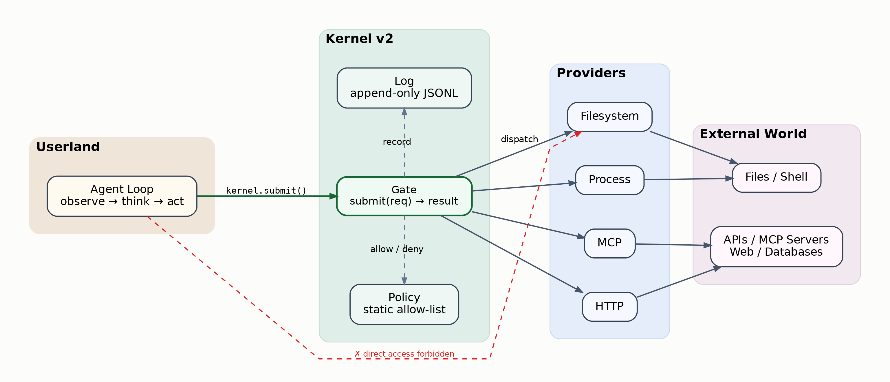
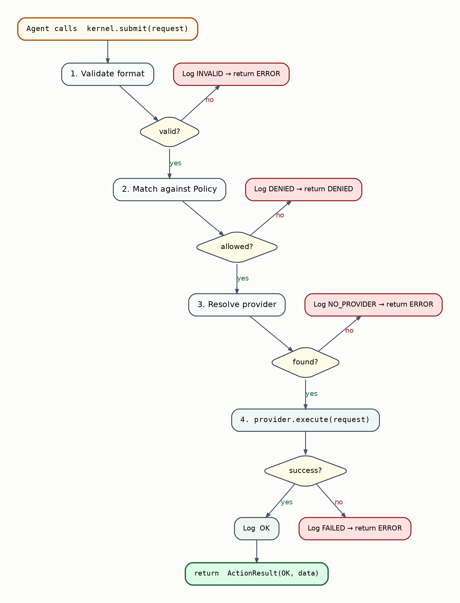
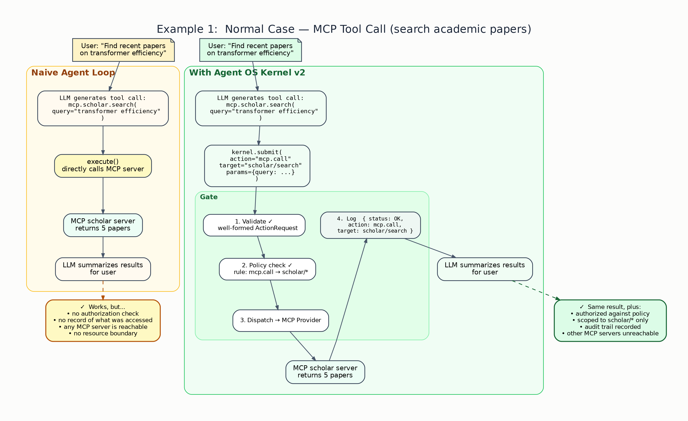
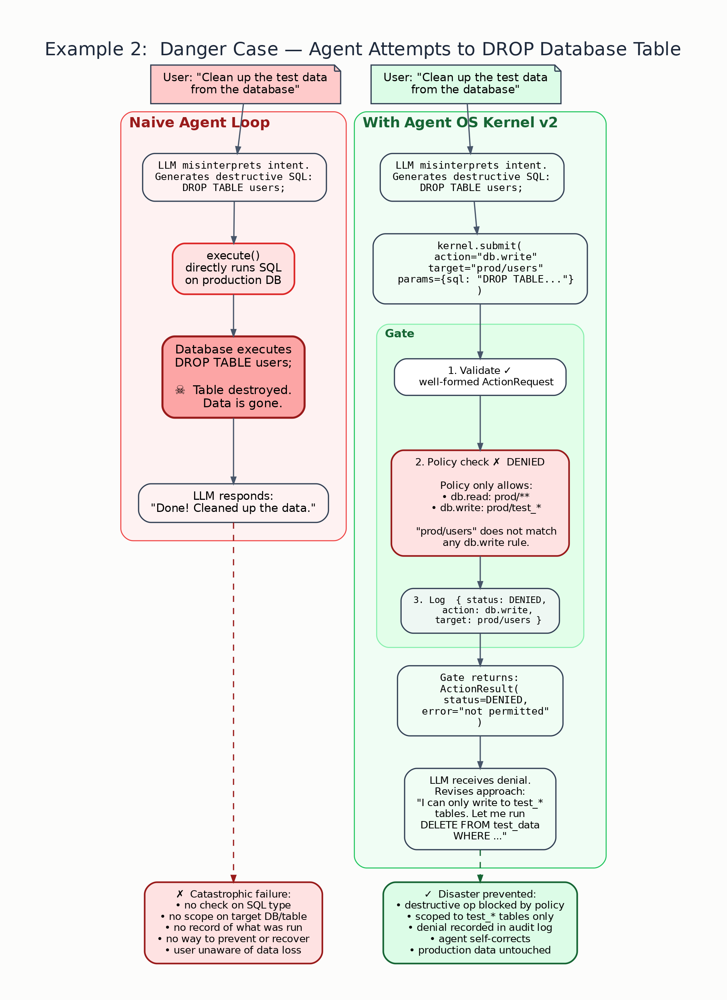

# Kernel Design v2

## Status

This document defines the **v2 design** of the **Agent OS Kernel**.

v2 is a further reduction of v1, scoped by three hard constraints:

- **open-source agent only** — we control and can modify the agent loop source code
- **single agent only** — one agent process, one execution identity, sequential execution
- **naive agent loop only** — the standard observe → think → act cycle, no orchestration

Under these constraints, many v1 mechanisms either collapse into simpler forms or become unnecessary.

v2 answers one question:

> What is the absolute minimum kernel for a single open-source agent that guarantees all world-facing actions are mediated, authorized, and recorded?

## 1. The Agent Loop Integration Point

A naive open-source agent loop has exactly one place where effects happen:

```python
while not done:
    action = llm.generate(messages)
    result = execute(action)       # ← the only point that touches the world
```

The kernel replaces `execute` with `kernel.submit`.

```python
while not done:
    action = llm.generate(messages)
    result = kernel.submit(action)  # ← all world access goes through here
```

That is the entire integration surface.

Because we control the source code, there is no need for an external sandbox or process-level isolation to enforce this. The original direct-call path simply does not exist in the modified agent loop. If someone forks the code and removes the kernel call, they have opted out — that is outside the security model's scope.

## 2. Architecture

### 2.1 Structure View

The structure diagram shows the four trust zones and the single mandatory path between them.

The visualization below is generated from [`kernel_design_v2_structure.dot`](./figures/kernel_design_v2_structure.dot).



The security boundary is:

```text
Agent Loop  →  Gate (Policy + Log)  →  Provider  →  World
```

If anything can skip that path, the kernel has failed.

### 2.2 Gate Flow View

The flow diagram shows the lifecycle of a single `kernel.submit()` call. Every path — success or failure — produces exactly one log record.

The visualization below is generated from [`kernel_design_v2_flow.dot`](./figures/kernel_design_v2_flow.dot).



### 2.3 Walkthrough: Normal Case — MCP Tool Call

To make the architecture concrete, this walkthrough compares the same scenario under a naive agent loop (left) versus an agent with the v2 kernel (right).

The agent is asked to search for academic papers. The LLM generates an MCP tool call. In the naive loop, the call goes directly to the MCP server with no authorization or audit. With the kernel, the same call passes through the Gate, is checked against policy, scoped to the permitted MCP server, and recorded.

The visualization below is generated from [`kernel_design_v2_example_normal.dot`](./figures/kernel_design_v2_example_normal.dot).



Both paths produce the same user-visible result. The difference is invisible to the user but critical for security: the kernel path guarantees that only permitted MCP servers are reachable, and every access is recorded.

### 2.4 Walkthrough: Danger Case — Destructive Database Operation

This walkthrough shows the case that motivates the kernel's existence.

The user asks the agent to "clean up test data." The LLM misinterprets the intent and generates `DROP TABLE users;`. In the naive loop, the SQL executes directly on the production database — data is destroyed, and the user may not even realize it. With the kernel, the Gate checks the action against policy. The policy only permits `db.write` on `test_*` tables. The request targeting `prod/users` is denied. The agent receives the denial, self-corrects, and issues a safe query instead.

The visualization below is generated from [`kernel_design_v2_example_danger.dot`](./figures/kernel_design_v2_example_danger.dot).



This is the central value proposition of the kernel: the LLM can still make mistakes, but the damage is bounded by policy.

### 2.5 Three Components

v1 defined five components. Under v2 constraints, they reduce to three:

| v2 Component | Absorbs from v1 | Role |
|---|---|---|
| **Policy** | Capability Enforcement + Resource Scoping | Static allow-list defining what may be done |
| **Gate** | Action Gateway + Provider Dispatcher | Single function: validate, check, dispatch, return |
| **Log** | Audit Record | Append-only record of every decision |

### 2.6 Why Three, Not Five

- **Action Gateway and Provider Dispatcher merge into Gate.** In a single sequential agent, there is no need for a separate ingress component and a separate dispatch component. The Gate receives the request, checks it, calls the provider, and returns the result. One function, one path.

- **Resource Scoping merges into Policy.** Scoping is how capabilities constrain the target of an action. In a single-agent system, this is just part of the capability matching logic — not a separate architectural component.

## 3. Policy

Policy is a static allow-list loaded at startup.

### 3.1 Structure

A policy is a set of **capability rules**. Each rule has three fields:

```
action    — the action type being permitted
resource  — the resource pattern being permitted
constraint (optional) — additional restrictions
```

### 3.2 Examples

```yaml
capabilities:
  - action: fs.read
    resource: /workspace/**

  - action: fs.write
    resource: /workspace/output/**

  - action: proc.exec
    resource: git

  - action: mcp.call
    resource: scholar/search

  - action: net.http
    resource: https://api.example.com/**
    constraint:
      method: GET
```

### 3.3 Matching Semantics

Matching is **prefix-based with glob support**:

- `fs.read` matches action type exactly
- `/workspace/**` matches `/workspace/` and everything below it
- `/workspace/output/report.md` is checked by walking the rules for `fs.write` and testing whether the target falls within a permitted resource pattern

The matching algorithm:

```python
def is_allowed(request, capabilities):
    for cap in capabilities:
        if cap.action == request.action and cap.resource_matches(request.target):
            if cap.constraint is None or cap.constraint_matches(request):
                return True
    return False
```

There are no deny rules. If no capability matches, the action is denied by default. **Default deny, explicit allow.**

### 3.4 Non-Features

Policy in v2 does **not** support:

- deny rules or priority ordering
- dynamic capability grant/revoke at runtime
- role-based or identity-based differentiation (single agent)
- conditional rules based on time, budget, or call count
- inheritance or delegation

These may exist in future versions. v2 does not need them.

## 4. Gate

Gate is a single function. It is the entire kernel API.

### 4.1 Signature

```python
def submit(action_request: ActionRequest) -> ActionResult:
```

### 4.2 Behavior

```
submit(request):
    1. validate request format         → if malformed: log(INVALID, request), return error
    2. match request against policy    → if no match:  log(DENIED, request),  return denied
    3. resolve provider for action     → if no provider: log(NO_PROVIDER, request), return error
    4. call provider.execute(request)  → if provider fails: log(FAILED, request, error), return error
    5. log(OK, request, result)
    6. return result
```

Every path through the Gate produces exactly one log entry. There are no silent paths.

### 4.3 Provider Resolution

The Gate maintains a static registry mapping action types to providers:

```python
providers = {
    "fs.read":   FilesystemProvider,
    "fs.write":  FilesystemProvider,
    "proc.exec": ProcessProvider,
    "mcp.call":  McpProvider,
    "net.http":  HttpProvider,
}
```

This registry is configured at startup and does not change at runtime.

### 4.4 Non-Features

The Gate does **not**:

- retry on failure (that is the agent loop's concern)
- queue or batch requests
- handle concurrency (single agent, sequential)
- transform or rewrite the request beyond format validation
- contain any domain logic

## 5. Log

Log is an append-only sequence of records.

### 5.1 Record Schema

```python
@dataclass
class Record:
    timestamp:  str            # ISO 8601
    action:     str            # e.g. "fs.read"
    target:     str            # e.g. "/workspace/data.csv"
    status:     str            # INVALID | DENIED | NO_PROVIDER | FAILED | OK
    error:      str | None     # error message if status is not OK
    duration_ms: int | None    # execution time if provider was called
```

### 5.2 Properties

- Append-only — records are never modified or deleted
- Kernel-exclusive write — only the Gate writes to the Log
- Readable by external tools — the Log is a file or stream that monitoring tools can consume

### 5.3 Implementation

For v2, the Log can be as simple as a JSONL file:

```jsonl
{"timestamp":"2026-03-23T10:00:01Z","action":"fs.read","target":"/workspace/data.csv","status":"OK","error":null,"duration_ms":12}
{"timestamp":"2026-03-23T10:00:02Z","action":"net.http","target":"https://evil.com","status":"DENIED","error":null,"duration_ms":null}
```

No database. No query engine. No rotation. Those are operational concerns, not kernel concerns.

## 6. Object Model

v2 needs exactly two objects:

### 6.1 ActionRequest

```python
@dataclass
class ActionRequest:
    action: str        # action type, e.g. "fs.read"
    target: str        # resource target, e.g. "/workspace/data.csv"
    params: dict       # action-specific parameters
```

### 6.2 ActionResult

```python
@dataclass
class ActionResult:
    status: str        # OK | DENIED | ERROR
    data:   Any        # provider return value, or None
    error:  str | None # error message if not OK
```

Context (from v1 §9.1) is no longer a runtime object. In a single-agent system, context is static configuration — it is the policy file itself.

Capability (from v1 §9.3) is not a runtime object. It is a rule in the policy file.

Record (from v1 §9.4) is a log entry, not a first-class domain object.

## 7. Provider Contract

Providers are the only components that touch the external world.

### 7.1 Interface

```python
class Provider:
    actions: list[str]

    def execute(self, request: ActionRequest) -> Any:
        raise NotImplementedError
```

### 7.2 Responsibilities

A provider:

- declares which action types it handles
- receives an already-authorized request from the Gate
- executes the real effect
- returns a result or raises an exception

A provider does **not**:

- check authorization (the Gate already did)
- write to the Log (the Gate does this)
- call other providers
- interact with the agent loop

## 8. Security Invariants

v2 retains the v1 invariants, restated for clarity:

### 8.1 All World Access Goes Through Gate

The agent loop's only path to the world is `kernel.submit()`. This is enforced by source code modification, not by runtime sandboxing.

### 8.2 Default Deny

Any action not explicitly permitted by a policy rule is denied.

### 8.3 No Silent Actions

Every call to `submit()` produces exactly one Log record, regardless of outcome.

### 8.4 Providers Are Unreachable From Agent Loop

The agent loop has no reference to provider instances. Only the Gate holds provider references.

## 9. What v2 Removes From v1

| v1 Concept | v2 Status | Reason |
|---|---|---|
| Action Gateway (standalone) | Merged into Gate | No need for separate ingress in single sequential agent |
| Resource Scoping (standalone) | Merged into Policy | Scoping = capability matching on resource patterns |
| Provider Dispatcher (standalone) | Merged into Gate | Static routing table, not an independent component |
| Context as runtime object | Eliminated | Single agent = static config = the policy file |
| Capability as runtime object | Eliminated | Capability = a rule in the policy file |
| Record as domain object | Downgraded to log entry | No need for rich queryable record type |
| `read_record(run_id)` API | Eliminated | Log is a file; read it with standard tools |
| `status(run_id)` API | Eliminated | Single sequential agent; status is synchronous return value |

## 10. Complete Kernel in Pseudocode

The entire v2 kernel:

```python
class Kernel:
    def __init__(self, policy_path: str, providers: dict[str, Provider]):
        self.policy = load_policy(policy_path)
        self.providers = providers
        self.log = open("kernel.log", "a")

    def submit(self, request: ActionRequest) -> ActionResult:

        # 1. validate
        if not valid(request):
            self._log(request, "INVALID")
            return ActionResult(status="ERROR", data=None, error="malformed request")

        # 2. authorize
        if not is_allowed(request, self.policy):
            self._log(request, "DENIED")
            return ActionResult(status="DENIED", data=None, error="not permitted")

        # 3. resolve provider
        provider = self.providers.get(request.action)
        if provider is None:
            self._log(request, "NO_PROVIDER")
            return ActionResult(status="ERROR", data=None, error="no provider")

        # 4. execute
        try:
            result = provider.execute(request)
            self._log(request, "OK")
            return ActionResult(status="OK", data=result, error=None)
        except Exception as e:
            self._log(request, "FAILED", error=str(e))
            return ActionResult(status="ERROR", data=None, error=str(e))

    def _log(self, request, status, error=None):
        record = {"timestamp": now(), "action": request.action,
                  "target": request.target, "status": status, "error": error}
        self.log.write(json.dumps(record) + "\n")
        self.log.flush()
```

That is the entire kernel. Roughly 30 lines of logic.

## 11. Summary

v2 is a kernel reduced to its absolute minimum under three constraints: single agent, open-source, naive loop.

It has **one API**: `submit(action_request) -> action_result`

It has **three components**: Policy, Gate, Log

It has **three invariants**: all access through Gate, default deny, no silent actions

Everything else — budgets, checkpoints, recovery, events, multi-agent isolation, dynamic capabilities — is out of scope. They can be layered on top. They are not the kernel.
